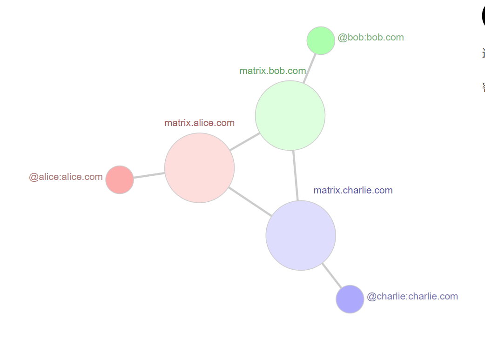

# 介绍

`Matrix` 是一个C/S架构的协议，每个服务器代表一个`Homeserver`，它负责维护属于下属的用户、聊天室等。
如果我们需要自建聊天服务器，就需要搭建一个`Homeserver`，这样聊天记录、用户数据就能安全的存储在自己的服务器里。

这样的优势是，不同的`Homeserver`之间可以组成联邦服务器，使得所有实现了`Matrix`协议的`Homeserver`的用户可以交流。
甚至借助开放的标准，可以同步其它实现了`Matrix`协议的主流聊天软件。

通过上图☝️我们可以发现，每个 `Matrix` 用户都会属于一个 `Homeserver`，有一个唯一的 ID `@user:servername.com`。

### tip

> 你可能不想要了解下面的东西， [快速开始](quick_start.html) 将教会你快速使用上 `Element` 客户端，与其它人进行聊天。

# 什么是 Matrix ？

`Matrix` 指定了一组实用的 **RESTful HTTP JSON API** 作为开放标准，它处理：

- 创建和管理完全分布式的聊天室，没有单点控制或故障
- 通过联合服务器和服务的全球开放网络实现房间状态的最终一致的加密安全同步
- 在具有（可选）端到端加密的房间中发送和接收可扩展消息
- 邀请、加入、离开、踢出、禁止房间成员
- 管理用户帐户（注册、登录、注销）
- 使用电子邮件地址、电话号码、Facebook 帐户等第 3 方 ID (3PID) 来验证、识别和发现 Matrix 上的用户。
- 进行 1:1 VoIP 和视频通话

这些 API 旨在在广泛的服务器、服务和客户端上实现，让开发人员在完全开放的 Matrix 生态系统之上构建消息传递和 VoIP 功能，而不是使用封闭或专有的解决方案。希望 Matrix 能够充当新一代完全开放和可互操作的互联网消息传递和 VoIP 应用程序的构建块。

Synapse 是由 matrix.org 核心团队开发的 Matrix“家庭服务器”实现，用 Python 3/Twisted 编写。

在 Matrix 中，每个用户都运行一个或多个 Matrix 客户端，这些客户端连接到 Matrix 主服务器。主服务器存储他们所有的个人聊天历史和用户帐户信息——就像邮件客户端连接到 IMAP/SMTP 服务器一样。就像电子邮件一样，您可以运行自己的 Matrix 家庭服务器并控制和拥有自己的通信和历史记录，或者使用由其他人托管的（例如 matrix.org）——Matrix 中没有单点控制或强制性服务提供商，不像WhatsApp、Facebook、环聊等

