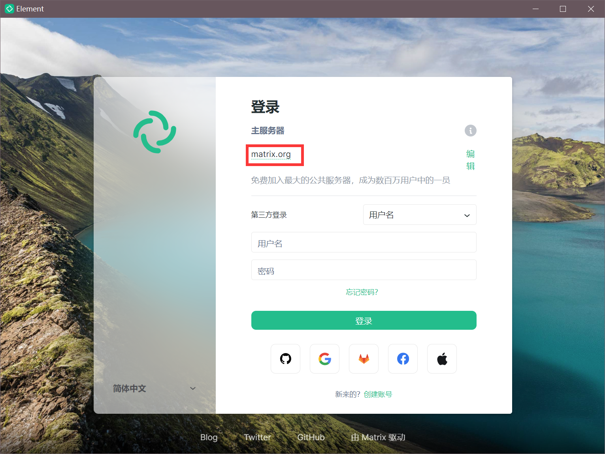
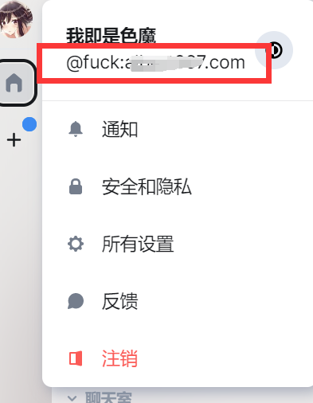

# 快速开始

在看本文前，你可能需要看一下 Matrix 关于 `Homeserver` 的 [介绍](introduction.html)。
当然，如果你只是服务器的一位用户，你也完全可以不用去了解这些细节，只需要知道你在使用1台主服务器聊天，
需要设置它即可。

了解了`Matrix`和其它聊天软件的不同之处后，我们就可以开始使用了。

## 客户端

`Matrix` 的客户端实现有很多，其中 `Element` 是 [官方](https://element.io/) 提供的客户端实现。
当然，我们也可以使用 [其它](https://matrix.org/docs/projects/try-matrix-now/#clients) 开源实现，
它们基本都涵盖了所有平台(Linux/Windows/Android/Mac/Ios)，如果你遇到打不开的情况，可能需要一些翻墙技巧的帮助。

👇**下面将提供 Element⚡ 使用步骤** 👇👇
### Element Windows客户端

由于笔者使用的 `Windows` 和 `Android` 平台， 所以演示 `Mac` 和 `IOS` 的客户端。但是理论上它们的交互甚至UI都是一致的。
你可以参考下面演示 `Element for Windows` 的交互逻辑，完成自己的第一次 Homeserver 配置，注册、登录等操作。

#### 安装

> 注意：请先 [配置](ss_proxy.html) Shadowsocks 代理 再继续下面的操作。

这个章节使用的是 [Windows 安装包](https://packages.riot.im/desktop/install/win32/x64/Element%20Setup.exe) ，
你也许需要其它的 [安装包](https://element.io/) ，安装步骤非常简单，双击它就会自动安装到用户应用路径: 
```text
C:\Users\%USERPROFILE%\AppData\Local\element-desktop
```
#### Homeserver 设置

如果你仔细看过关于 Homeserver 的 [介绍](introduction.html)，你可以发现由于 Matrix 是通过 Homeserver 维护用户和聊天室，
我们需要做的是**将这个 Homeserver 配置在登录注册中**，以便向目标的 Matrix Server 请求服务。

- `Homesever` 你可以理解为一个私有的服务器。
- 如果你是第一次使用，需要向这个 Homeserver 进行**创建账号**。需要注意的是，Homeserver 的管理员需要开启注册配置。
- 如图，默认它是官方的 Homesever。我们将 `matrix.org` 替换成自己的 Homesever 即可。



#### 储存自己的密钥

登录成功后，你需要保存自己的密钥，它是一串字符，你也可以用文本的形式保存，基本上它被命名为：
```text
security-key.txt
```
以后再登录时需要用它进行校验，或者用其它在线的平台扫码校验，但这总归部署方便的，所有需要注意不要丢失它。

#### Matrix ID

点击头像后，你会发现自己的`Matrix ID`。它是一个唯一的身份信息，添加用户时你将用到它。

基本上，它是这样组成的：

```
@user:servername.com
@用户名:配置的servernname
```
如图：



## 服务端

...