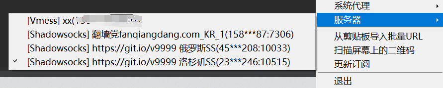

# 实用的代理技巧

如果你没有忘记看 [README](readme_link.html) ⚡，那么应该会注意到使用 Matrix 的前提可能需要一些代理技巧。

具体则是笔者使用 **Element for Windows** 过程中遇到了安装后需要向被墙的网络下载本地化资源的问题， 同时有人向我反应 **Mac** 也有相同的问题。


也就是说当你使用官方客户端时涉及初始化不同国家地区语言的操作时，必须掌握一些翻墙的技巧才能让 Element 客户端正常工作。
~~不过已经2202年了，不会还有人不知道怎么翻墙吧，不会吧不会吧？~~ 😜

🥳 这个章节将教会大家一些临时的代理小技巧

> 需要注意的是，这些免费翻墙服务器不少与境外的轮子和反贼相关，虽然是本章节的教学是基于 github 的 repo 展开，但是可能存在传播上的法律风险，
> 希望看完这本电子书后，尽量不去看、不传播相关的内容。

[Github](https://github.com) 是一个面向开源的代码托管平台，目前已经被微软收购。
鉴于国内的开源使用需求和开源世界的政治正确，GFW 目前还没有将之封杀，但是时不时抽风连不上。

> ~~如果你遇到了连不上的情况，说明需要泡杯茶等一会再点开看看。~~ 现在，我们只需要 `网易UU` 免费加速 `Github`，需要在网易UU里搜索加速至 **学术资源** ，这样不需要一些修改 hosts 的奇技淫巧即可获得良好的体验。如果你没有下载`网易UU加速器`，请[点击这里](https://uu.163.com/)，找到合适的版本进行安装。


Github 除了代码托管，也有各种乱七八糟的资源，我们需要在一个没有被墙的地方获取翻墙工具，
这就是再也合适不过的平台。

[Share-SSR-V2ray](https://github.com/selierlin/Share-SSR-V2ray) 是 Github 上托管的一个仓库，我们将基于它展开章节。

### 工具使用

由于 Github 经常抽风，笔者已经将 [Share-SSR-V2ray](https://github.com/selierlin/Share-SSR-V2ray) 中 `shadowsocks` 各平台工具的使用方法拷贝到了附录，详见[介绍](introduction.html)。

下面介绍白嫖仓库中收集的 Shadowsocks 的使用方法。至于其它几种工具(Clash、ShadowsockR、V2ray和浏览器插件代理等)，请等待施工或者自行探索。


### 订阅 Shadowsocks 服务

Shadowsocks 是一个 C/S 架构的代理工具，它由境外没有被 GFW 封杀的服务器搭建 Server 端提供流量代理转发能力，
通过用户安装的 Client 端开启 PAC 或者系统代理。

Client 端将用户被拦截的请求将被 Server 端代理，由 Server 端将这个请求发送至真正的目标，Server 端得到响应后解包再发送给用户，由此让客户端代理的主机无感知的绕过防火墙请求境外网站。

所以，代理的前提是必须有一台设在境外没有被 GFW 墙的服务器，但是因为其具有成本和技术的门槛，所以推荐使用第三方提供的服务。
以下将介绍付费和白嫖的方法。

#### 供应商
如果你愿意付费使服务更稳定，[这里](https://github.com/selierlin/Share-SSR-V2ray/blob/master/1-share-ssr-v2ray.md) 有被推荐的机场，
优点是它们的主页因为维护较好，基本不会被 GFW 墙而且有相当多的节点使用起来省心可靠，不过需要注意供应商跑路的风险，不要买太长的时间减少沉没成本。

当然我们可能只需要使用一下，那么试用白嫖无疑是你最好的选择。

> 理论上如果你可以不断的注册邮箱，那么可以无限制的进行试用。有机会再介绍这种方法。

#### 白嫖 Shadowsocks Server

鉴于国内始终无法下定决心对 Github 下杀手，那么最可靠的方式可能是通过别人更新在 GitHub 仓库里的 Shadowsocks 账号（~~目前经过笔者测试，其它方式已经阵亡都需要翻墙了~~，
这是[Share-SSR-V2ray](https://github.com/selierlin/Share-SSR-V2ray) 推荐持续在更新的 [Github仓库](https://github.com/Alvin9999/new-pac/wiki/ss%E5%85%8D%E8%B4%B9%E8%B4%A6%E5%8F%B7) ，
目前测试该仓库可以正常使用。

我们使用 `Ctrl + F` 搜索关键词：
```text
ss://
``` 

下图类似的链接你可以任意复制一个：


> 截图中 ssr 链接无法用 Shadowsocks 客户端导入，所以你应该使用搜索到的链接。
> 如果想要使用，具体可以看 [shadowsockR](https://github.com/selierlin/Share-SSR-V2ray#shadowsockR-%E4%BD%BF%E7%94%A8%E6%95%99%E7%A8%8B) 的介绍。

#### 使用和配置 Shadowsocks

复制ssr链接后，**右键点击系统右下角的 Shadowsocks 托盘 -> 从剪贴板导入URL**。


导入成功后，通过 `右键托盘 -> 服务器 -> 节点` 选中你刚刚导入的 ss 节点，



最后`右键托盘 -> 系统代理 -> 全局代理` 即可。


> 笔者目前使用的是 v2rayN ，不过这两个 UI 类似，截图是错误的，但是文字描述是正确的。你也可以看**工具附录**拷贝的 
> [具体](ss/2-windows-setup-guide-cn.html) 使用方式。

不需要使用时记得关闭代理，它会让你访问一些国内的网站变得困难。

你也可以参考工具附录中的 [配置 Shadowsocks 账号](ss/2-windows-setup-guide-cn.html) 介绍导入节点信息。
